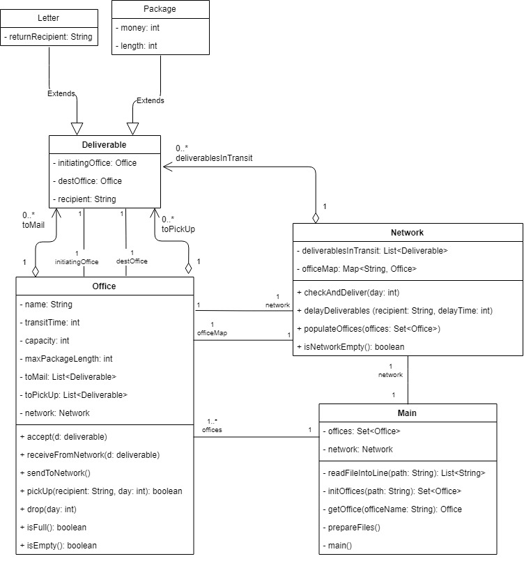
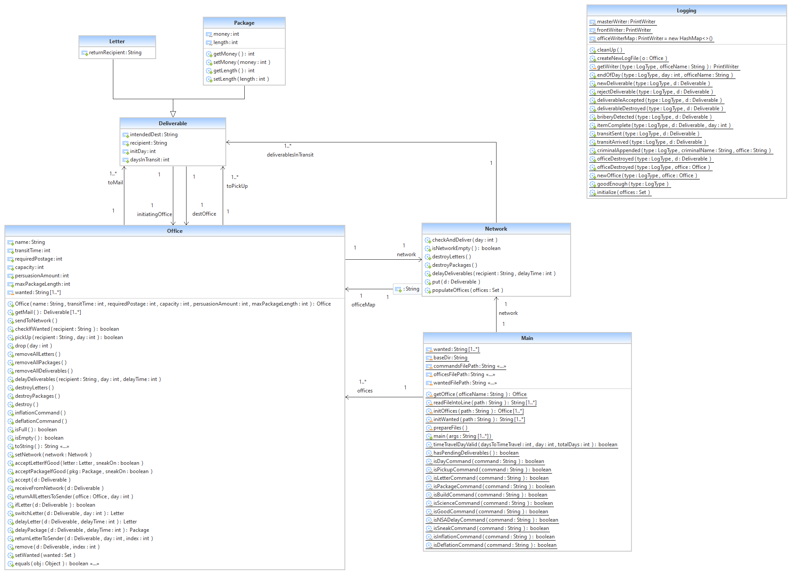

# Postal-Delivery-System

Object-Oriented Programming in Java  
Feb - Mar 2016  

 

<b>Postal Delivery System:</b>  
The application sets up offices then executes the commands that simulate the work of operations in postal offices.  
Results are written on a text file for each office.  

 

<b>How it works:</b>  
1. Initializes offices read from "Offices.txt"  
2. Initializes black-listed customers read from "Wanted.txt"  
3. Execute commands read from "Commands.txt"  

 

<b>Text Files:</b>   
1. Offices.txt   
&nbsp;&nbsp;&nbsp;&nbsp;- Contains a list of offices to be created in the beginning of the program  
&nbsp;&nbsp;&nbsp;&nbsp;- Offices have properties such as name, days to travel, storage space, and max package length.  
&nbsp;&nbsp;&nbsp;&nbsp;- Offices can accept or reject deliverables based on exceeding max length or lacking storage space.  

 
2. Wanted.txt   
&nbsp;&nbsp;&nbsp;&nbsp;- Contains a list of criminals that are prevented from picking up packages  
&nbsp;&nbsp;&nbsp;&nbsp;- Wanted criminals have a name property and are separated by a new line.  
 
3. Commands.txt   
&nbsp;&nbsp;&nbsp;&nbsp;- Contains a list of commands to be executed  
&nbsp;&nbsp;&nbsp;&nbsp;- List of Commands:  
&nbsp;&nbsp;&nbsp;&nbsp;&nbsp;&nbsp;&nbsp;&nbsp;- Day: Ends the current working day. Deliverables are sent out from each office if any. 
&nbsp;&nbsp;&nbsp;&nbsp;&nbsp;&nbsp;&nbsp;&nbsp;- Letter: Places a letter deliverable in the office 
&nbsp;&nbsp;&nbsp;&nbsp;&nbsp;&nbsp;&nbsp;&nbsp;- Package: Places a package deliverable in the office 
&nbsp;&nbsp;&nbsp;&nbsp;&nbsp;&nbsp;&nbsp;&nbsp;- Pickup: Pickup all deliverables designated to a recepient 
 

<b>Classes:</b>  
1. Main  
2. Office  
3. Network  
4. Deliverable  
4.1 Package  
4.2 Letter  
5. Logging  
 

<b>Basic UML Diagram:</b>  

 
<b>Detailed UML Diagram:</b>  

